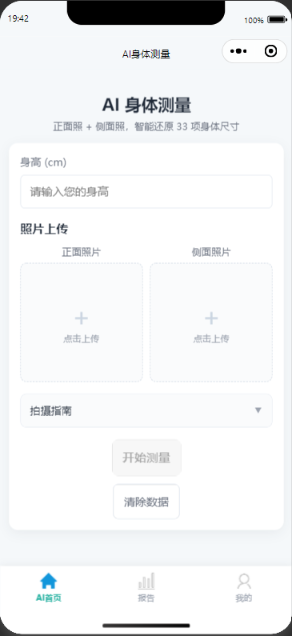
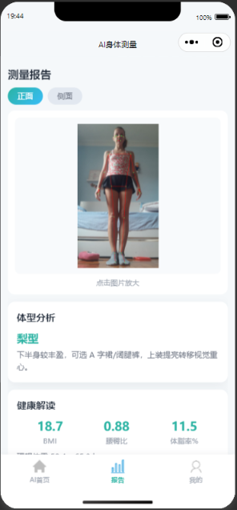
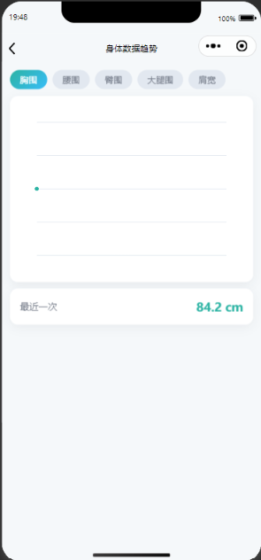

# AI 身体测量小程序

一个基于 **微信小程序 + FastAPI + MediaPipe** 的 AI 人体测量应用：用户上传正面 + 侧面两张全身照，即可自动还原 33 项身体尺寸，并生成关键点标注图、体型分析、健康指标与趋势报告。

> 项目定位为个人学习/求职作品，测量结果为基于姿态估计的比例估算，仅供参考，不构成医疗建议。

## 功能特性

- **AI 身体测量**：上传正面照 + 侧面照，基于 MediaPipe Pose 检测人体 33 个关键点，结合身高换算 33 项身体尺寸（胸围、腰围、臀围、肩宽、臂长、腿长等）。
- **关键点可视化**：自动生成正/侧面的人体姿态关键点标注图，可放大预览。
- **体型分析**：根据三围与肩宽自动分类（沙漏型 / 梨型 / 苹果型 / 倒三角型 / 矩型），并给出穿搭建议。
- **健康指标**：BMI、腰臀比、体脂率、理想体重区间。
- **数据趋势**：手绘 Canvas 折线图，展示胸围 / 腰围 / 臀围等 5 项指标的历史变化。
- **报告分享卡片**：Canvas 绘制报告卡片，一键保存到相册。
- **服装尺码推荐**：根据测量尺寸推荐服装尺码。
- **用户体系**：注册 / 登录（JWT 鉴权）、身体档案（性别 / 年龄 / 体重）、测量记录管理。

## 技术栈

| 层 | 技术 |
|---|---|
| 前端 | 微信小程序原生（WXML / WXSS / JS），基础库 3.8.3 |
| 后端 | FastAPI · Uvicorn · SQLAlchemy |
| AI | MediaPipe Pose · OpenCV · NumPy |
| 数据库 | MySQL |
| 鉴权 | JWT（python-jose + passlib） |

## 项目结构

```
AI身体测量/
├── miniprogram/              # 微信小程序前端
│   ├── app.js / app.json / app.wxss
│   ├── custom-tab-bar/       # 自定义底部导航
│   ├── pages/
│   │   ├── measure/          # AI 首页（拍照/上传 → 测量）
│   │   ├── result/           # 测量报告（详情/体型/健康指标/分享卡片）
│   │   ├── trend/            # 数据趋势折线图
│   │   ├── profile/          # 身体档案
│   │   ├── user/             # 我的（登录/注册/统计）
│   │   ├── bmi/              # BMI 计算
│   │   ├── clothing-size-recommendation/  # 服装尺码推荐
│   │   └── ...
│   └── utils/
│       ├── request.js        # 网络请求封装（含 BASE_URL）
│       └── body-analysis.js  # 体型分类与健康指标纯函数
├── backend/                  # FastAPI 后端
│   ├── app/
│   │   ├── main.py           # 应用入口
│   │   ├── config.py         # 配置（支持 .env）
│   │   ├── database.py       # SQLAlchemy 引擎与会话
│   │   ├── models/           # 数据模型
│   │   ├── routers/          # 路由（auth / measurement / upload / bmi）
│   │   └── services/         # 业务逻辑（AI 模型、尺寸计算、认证）
│   └── requirements.txt
└── schema.sql                # 数据库结构参考（仅建表）
```

## 本地运行

### 1. 后端

```bash
cd backend

# 建议使用虚拟环境
python -m venv .venv
source .venv/bin/activate        # Windows: .venv\Scripts\activate

pip install -r requirements.txt

# 配置数据库（复制 .env.example 为 .env 并填入真实值）
# 或直接修改 app/config.py 中的 DATABASE_URL

uvicorn app.main:app --reload --host 0.0.0.0 --port 8000
```

启动后访问 `http://127.0.0.1:8000/docs` 可查看接口文档。

### 2. 前端（微信小程序）

1. 使用微信开发者工具导入 `miniprogram/` 目录。
2. 修改 `miniprogram/utils/request.js` 中的 `BASE_URL` 为后端地址（本地开发默认 `http://127.0.0.1:8000/api`）。
3. 在开发者工具中打开「不校验合法域名」即可本地联调。

## 核心实现说明

- **尺寸计算**：`backend/app/services/ai_model.py` 使用 MediaPipe Pose（`model_complexity=1`）提取人体关键点，通过「身高 → 像素比例尺」换算真实尺寸；侧身照用于估算身体厚度（围度）。
- **体型/健康指标**：`miniprogram/utils/body-analysis.js` 为纯函数模块，输入测量明细，输出体型分类与 BMI / 腰臀比 / 体脂率等指标。
- **图表与报告卡片**：均使用小程序 `<canvas type="2d">` 手绘，无第三方图表库依赖。

## 项目截图

> 将截图放入 `screenshots/` 目录，并在下方替换占位路径。

| 首页 | 测量报告 | 数据趋势 |
| --- | --- | --- |
|  |  |  |

## 免责声明

本项目测量结果由姿态估计算法按人体比例估算得出，仅用于技术演示与学习交流，不作为任何医疗、健康或定制服装的正式依据。
